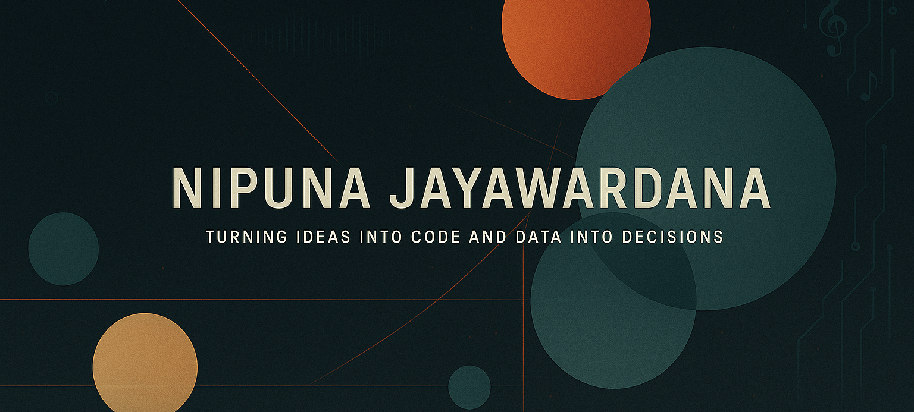

<h1 align="center">Hi 👋, I'm Nipuna Jayawardana</h1>
<h3 align="center">🚀 A passionate tech enthusiast, creative thinker, and problem solver from Sri Lanka 🇱🇰</h3>

💡 Ever since I discovered the world of technology, I’ve been inspired by how software can transform lives, reshape industries, and solve real-world problems in powerful ways. That spark 🔥 led me to dive into software development — and the journey has been exciting, challenging, and incredibly rewarding.💻 I love exploring the latest tech stacks, frameworks, and tools ⚙️ — and using them to build modern, user-friendly, and performance-driven applications. Whether it’s designing clean UIs 🎨, optimizing backend systems 🔧, or learning something new every day 📚, I’m always striving to level up and bring ideas to life through code 💻✨.🌱 Currently, I’m focused on growing my skills in full-stack development, DevOps, and cloud technologies ☁️ — and I’m always open to collaborating on cool and meaningful projects 🤝.

 

  
  

   
  
  
  
  
  
 

 

 

- 🔭 I’m currently working on 

- 🌱 I’m currently learning 

- 👨‍💻 All of my projects are available at 

- 💬 Ask me about 

- 📫 How to reach me 

- 📄 Know about my experiences

- ⚡ Fun fact 

 

 
 <h3 align="left">Languages and Tools:</h3>

- Frontend

  

- Backend

  

- Database

  

- Cloud Servers

  

- Tools

  

 

